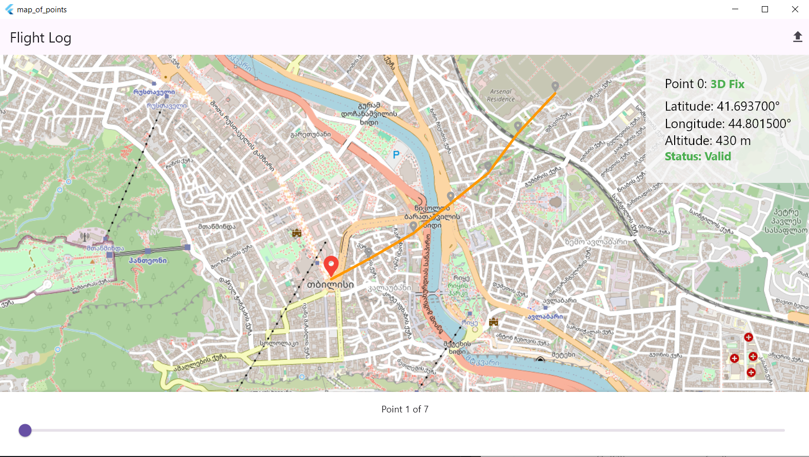
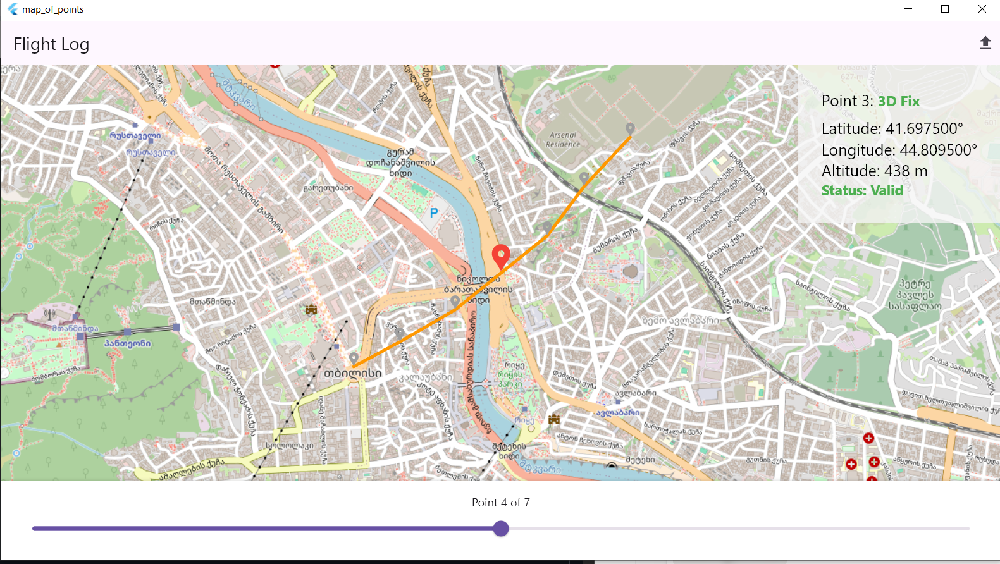
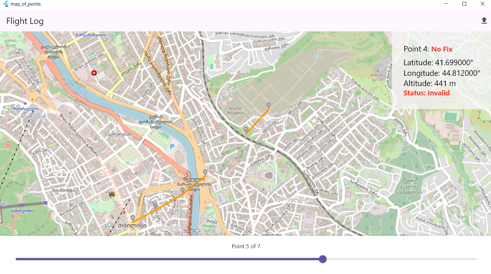

# GPS Flight Log Visualizer

A Flutter desktop application for decoding GPS flight logs from a custom binary format and interactively inspecting the recorded data on a map.

Originally developed as a take-home assignment for an aviation systems company. The assignment was estimated at 5 days and was completed independently in 1 day.

## Screenshots

### Flight log overview



Valid GPS records are displayed on an interactive map together with the reconstructed flight path and the selected record's telemetry.

### Navigating through the log



The timeline slider allows individual records to be inspected while the map follows the selected position.

### Invalid GPS record



Invalid records remain available for inspection but are excluded from the rendered trajectory, producing a visible gap in the path.

## Key Features

- **Custom binary GPS log parsing** — reads a fixed 11-byte record format and converts raw bytes into `GpsPoint` models.
- **Isolate-based processing** — binary parsing runs in a separate Dart isolate to keep the UI responsive.
- **GPS validation** — invalid records are preserved for inspection without being rendered on the map.
- **Interactive map** — displays valid GPS points and the reconstructed flight path.
- **Timeline-based inspection** — navigate through the log and inspect individual telemetry records.
- **Synchronized selection** — records can be selected through the timeline or directly on the map.
- **Error feedback** — invalid input and processing failures are surfaced through user-facing notifications.

## Technical Approach

### Data processing

The main data flow is:

```text
Binary file
    ↓
Raw bytes
    ↓
Dart isolate
    ↓
Binary parser
    ↓
GpsPoint models
    ↓
Validation
    ↓
Application state
    ↓
Map + timeline + telemetry
```

### Binary format

The input file uses a fixed-size 11-byte record:

| Field | Size | Description |
|---|---:|---|
| `gpsFix` | 1 byte | GPS fix status |
| `latitude` | 4 bytes | Latitude, scaled by `1e7` |
| `longitude` | 4 bytes | Longitude, scaled by `1e7` |
| `altitude` | 2 bytes | Signed altitude value |

The decoded records are converted into domain-level `GpsPoint` objects before being consumed by the UI.

<details>
<summary>Handling invalid GPS data</summary>

Invalid records are not discarded. They remain part of the loaded log so the user can inspect their telemetry and validity state.

```text
Valid point
    → displayed on the map
    → included in the trajectory

Invalid point
    → preserved for inspection
    → excluded from the map
    → creates a gap in the trajectory
```

This keeps unreliable data visible without presenting it as part of a continuous flight path.

</details>

<details>
<summary>Architecture</summary>

The project was designed and implemented from scratch. Responsibilities are separated between presentation, application/domain logic, and data processing.

```text
Presentation
├── Flutter UI
├── BLoC state management
├── Timeline / map interaction
└── Error notifications

Application / Domain
├── GPS point model
├── Validation logic
└── Track building

Data processing
├── Binary file loading
├── Binary parser
└── Isolate-based processing
```

BLoC keeps application state and processing logic separated from the widgets, while the parser and track-building logic remain independent from the map presentation.

</details>

## Tech Stack

- **Dart / Flutter**
- **BLoC** for state management
- **AutoRoute** for navigation
- **flutter_map** with **OpenStreetMap**
- **Dart isolates** for background data processing

## Assignment Context

The project was created as a take-home assignment for an aviation systems company. The original task included:

- decoding the provided binary GPS data;
- displaying GPS records on a map;
- handling invalid GPS records;
- navigating records with a slider;
- using a Dart isolate for data processing.

The assignment had an estimated completion time of approximately **5 days** and was completed independently in **1 day**.

The project was subsequently followed by an offer to join the company as a Flutter Engineer.

## Running the Project

### Requirements

- Flutter SDK
- Windows desktop support enabled

### Run

```bash
flutter pub get
flutter run -d windows
```

The application expects a `.bin` file following the required GPS binary format.

## Notes

The binary format is defined by the original assignment and uses a fixed 11-byte record format.

The application is a desktop visualization and inspection tool rather than a navigation system.
